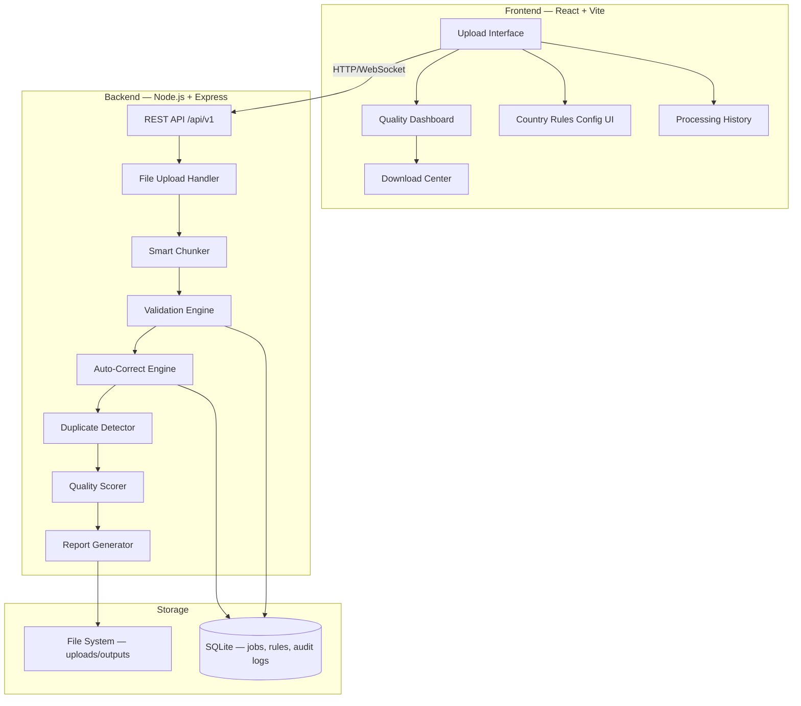
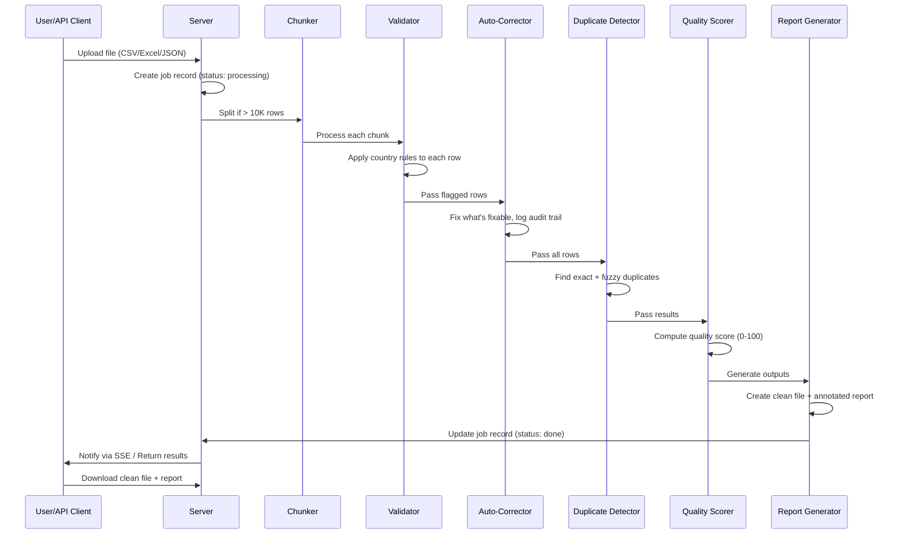

# XenoValidator — Transaction Data Validation & Processing Platform

Build a production-grade web platform that goes far beyond "upload → validate → download" by offering configurable country rules, intelligent auto-correction, data quality scoring, duplicate detection, a REST API, and async processing for large files.

## Architecture Overview



---

## What Makes This Unique (6 Differentiators)

| # | Feature | Why It Stands Out |
|---|---------|-------------------|
| 1 | **Config-driven country rules** | A JSON/UI-editable table, not hardcoded `if/else`. Adding Singapore is a data entry, not a code change. |
| 2 | **Row-level annotated error report** | Output Excel with bad cells **highlighted in red** and cell comments explaining exactly what's wrong. |
| 3 | **Data Quality Score (0–100)** | A single "credit score" per upload — instant business review instead of reading tables. |
| 4 | **Auto-correct with audit trail** | Strip spaces/dashes from phones, normalize dates, log every change so nothing is silently altered. |
| 5 | **Duplicate transaction detection** | Exact + fuzzy matching (same customer + amount + near-identical timestamp). Real pain point in messy data. |
| 6 | **REST API alongside UI** | `POST /api/v1/validate` — since Xeno is an integrations company, this signals you understand their product context. |

---

## Tech Stack

| Layer | Technology | Rationale |
|-------|-----------|-----------|
| Frontend | **React 18 + Vite** | Fast dev server, HMR, modern bundling |
| Styling | **Vanilla CSS** with CSS custom properties | Full design control, dark mode, glassmorphism |
| Backend | **Node.js + Express** | Simple, proven, great ecosystem for file processing |
| Validation | **Custom engine** + country rules JSON | Configurable, extensible |
| File Processing | **xlsx** (Excel), **csv-parser**, **json2csv** | Read/write CSV/Excel/JSON |
| Database | **SQLite via better-sqlite3** | Zero setup, stores jobs/rules/audit logs |
| Real-time | **Server-Sent Events (SSE)** | Progress updates for async processing |
| Testing | **Vitest** (unit) | Fast, Vite-native |

---

## Proposed Changes

### Project Structure

```
xeno/
├── client/                          # React + Vite frontend
│   ├── index.html
│   ├── vite.config.js
│   ├── package.json
│   ├── src/
│   │   ├── main.jsx                 # App entry
│   │   ├── App.jsx                  # Router + layout
│   │   ├── index.css                # Global design system
│   │   ├── components/
│   │   │   ├── FileUpload.jsx       # Drag & drop uploader
│   │   │   ├── QualityDashboard.jsx # Score gauge + breakdown
│   │   │   ├── ValidationReport.jsx # Row-level error table
│   │   │   ├── CountryRulesEditor.jsx # CRUD for country rules
│   │   │   ├── ProcessingHistory.jsx  # Past uploads
│   │   │   ├── ProgressTracker.jsx  # Real-time progress bar
│   │   │   └── Navbar.jsx           # Navigation
│   │   ├── pages/
│   │   │   ├── HomePage.jsx         # Landing + upload
│   │   │   ├── DashboardPage.jsx    # Results view
│   │   │   ├── ConfigPage.jsx       # Country rules management
│   │   │   ├── HistoryPage.jsx      # Processing history
│   │   │   └── ApiDocsPage.jsx      # REST API documentation
│   │   └── utils/
│   │       └── api.js               # API client helpers
│   └── public/
│       └── favicon.svg
│
├── server/                          # Node.js + Express backend
│   ├── package.json
│   ├── index.js                     # Server entry
│   ├── config/
│   │   └── countryRules.json        # Default country validation rules
│   ├── routes/
│   │   ├── upload.js                # File upload endpoints
│   │   ├── validate.js              # REST API validation endpoint
│   │   ├── rules.js                 # Country rules CRUD
│   │   ├── jobs.js                  # Job status/history
│   │   └── download.js              # File download endpoints
│   ├── engine/
│   │   ├── chunker.js               # Smart file chunking
│   │   ├── validator.js             # Core validation engine
│   │   ├── autoCorrect.js           # Auto-correction with audit
│   │   ├── duplicateDetector.js     # Exact + fuzzy duplicate detection
│   │   ├── qualityScorer.js         # Data quality score (0-100)
│   │   └── reportGenerator.js       # Excel report with highlights
│   ├── db/
│   │   └── database.js              # SQLite setup + queries
│   ├── middleware/
│   │   └── errorHandler.js          # Global error handling
│   └── utils/
│       └── fileHelpers.js           # File type detection, parsing
│
├── uploads/                         # Uploaded files (gitignored)
├── outputs/                         # Processed outputs (gitignored)
└── package.json                     # Root workspace package.json
```

---

### Component Details

---

#### Backend — Server Core

##### [NEW] [server/index.js](file:///c:/Users/sudee/Desktop/work/xeno/server/index.js)
- Express server with CORS, file upload (multer), JSON parsing
- Mount routes: `/api/v1/upload`, `/api/v1/validate`, `/api/v1/rules`, `/api/v1/jobs`, `/api/v1/download`
- SSE endpoint for real-time progress: `/api/v1/progress/:jobId`
- Error handling middleware
- Serves static client build in production

##### [NEW] [server/config/countryRules.json](file:///c:/Users/sudee/Desktop/work/xeno/server/config/countryRules.json)
Default configurable rules — the core differentiator:
```json
{
  "IN": {
    "name": "India",
    "phoneLength": 10,
    "phoneRegex": "^[6-9]\\d{9}$",
    "dateFormats": ["YYYY-MM-DD", "DD/MM/YYYY", "DD-MM-YYYY"],
    "currencyCode": "INR",
    "currencySymbol": "₹"
  },
  "SG": {
    "name": "Singapore",
    "phoneLength": 8,
    "phoneRegex": "^[689]\\d{7}$",
    "dateFormats": ["YYYY-MM-DD", "DD/MM/YYYY"],
    "currencyCode": "SGD",
    "currencySymbol": "S$"
  },
  "US": { ... },
  "GB": { ... },
  "AE": { ... }
}
```

##### [NEW] [server/db/database.js](file:///c:/Users/sudee/Desktop/work/xeno/server/db/database.js)
SQLite database with tables:
- `jobs` — id, filename, status (pending/processing/done/failed), quality_score, total_rows, valid_rows, created_at
- `audit_log` — id, job_id, row_number, field, original_value, corrected_value, action, timestamp
- `country_rules` — id, country_code, name, phone_length, phone_regex, date_formats, currency_code (overrides JSON file)
- `error_log` — id, job_id, row_number, field, error_type, message, severity

---

#### Backend — Processing Engine

##### [NEW] [server/engine/chunker.js](file:///c:/Users/sudee/Desktop/work/xeno/server/engine/chunker.js)
Smart file chunking:
- Detect file size; if > 5MB or > 10,000 rows, split into chunks of 5,000 rows
- Preserve header row in each chunk
- Process chunks sequentially, merge results
- Emit progress events via SSE (% complete)

##### [NEW] [server/engine/validator.js](file:///c:/Users/sudee/Desktop/work/xeno/server/engine/validator.js)
Core validation engine — the brain of the system:
- **Phone validation**: Lookup country rule → check length + regex match → annotate with specific error ("phone has 9 digits, expected 10 for IN")
- **Email validation**: Regex + domain check
- **Date validation**: Try parsing against country-specific formats, detect format mismatches
- **Required field checks**: Null/empty detection for critical fields (customer_id, email, phone)
- **Type validation**: Numeric fields are numeric, dates parse correctly
- **Format validation**: Email format, currency format, ID format
- Returns array of `{ row, field, errorType, message, severity }` objects

##### [NEW] [server/engine/autoCorrect.js](file:///c:/Users/sudee/Desktop/work/xeno/server/engine/autoCorrect.js)
Auto-correction with full audit trail:
- **Phone cleanup**: Strip spaces, dashes, dots, parentheses; remove country code prefix
- **Date normalization**: Convert detected format to ISO 8601 (YYYY-MM-DD)
- **Whitespace trimming**: Leading/trailing spaces in all text fields
- **Case normalization**: Email to lowercase, city names to title case
- Every correction logged to `audit_log` table with before/after values

##### [NEW] [server/engine/duplicateDetector.js](file:///c:/Users/sudee/Desktop/work/xeno/server/engine/duplicateDetector.js)
Duplicate detection (unique differentiator):
- **Exact duplicates**: Hash of all fields → flag identical rows
- **Fuzzy duplicates**: Same customer_id + same amount + timestamp within 60 seconds → likely duplicate transaction
- **Near-match names**: Levenshtein distance on customer names to catch typos ("Shanaya Madan" vs "Shanaya Madaan")
- Returns duplicate groups with confidence scores

##### [NEW] [server/engine/qualityScorer.js](file:///c:/Users/sudee/Desktop/work/xeno/server/engine/qualityScorer.js)
Data Quality Score (0–100) — like a credit score for your data:
```
Score = weighted average of:
  - Completeness (30%): % of non-null required fields
  - Validity (30%): % of rows passing all validation rules
  - Consistency (20%): % of rows with consistent formats
  - Uniqueness (20%): % of non-duplicate rows

Grade: A (90-100), B (80-89), C (70-79), D (60-69), F (<60)
```

##### [NEW] [server/engine/reportGenerator.js](file:///c:/Users/sudee/Desktop/work/xeno/server/engine/reportGenerator.js)
Report generation (2 outputs per job):
1. **Cleaned data file** (CSV/Excel) — auto-corrected, duplicates flagged, ready for import
2. **Annotated error report** (Excel) — original data with:
   - Red-highlighted cells for errors
   - Yellow-highlighted cells for auto-corrected values
   - Cell comments explaining each issue
   - Summary sheet with quality score breakdown
   - Audit trail sheet showing all auto-corrections

---

#### Backend — API Routes

##### [NEW] [server/routes/upload.js](file:///c:/Users/sudee/Desktop/work/xeno/server/routes/upload.js)
- `POST /api/v1/upload` — Accept CSV/Excel/JSON via multipart form
- Validate file type, create job record, start processing pipeline
- Return `{ jobId, status: 'processing' }`

##### [NEW] [server/routes/validate.js](file:///c:/Users/sudee/Desktop/work/xeno/server/routes/validate.js)
REST API endpoint (unique differentiator for Xeno context):
- `POST /api/v1/validate` — Accept JSON body with transaction data array
- Apply same validation engine, return results inline
- `POST /api/v1/validate/file` — Accept file via multipart, return results

##### [NEW] [server/routes/rules.js](file:///c:/Users/sudee/Desktop/work/xeno/server/routes/rules.js)
Country rules CRUD:
- `GET /api/v1/rules` — List all country rules
- `POST /api/v1/rules` — Add a new country rule
- `PUT /api/v1/rules/:code` — Update a country rule
- `DELETE /api/v1/rules/:code` — Delete a country rule

##### [NEW] [server/routes/jobs.js](file:///c:/Users/sudee/Desktop/work/xeno/server/routes/jobs.js)
- `GET /api/v1/jobs` — List all processing jobs with status
- `GET /api/v1/jobs/:id` — Get job details with quality score + breakdown

##### [NEW] [server/routes/download.js](file:///c:/Users/sudee/Desktop/work/xeno/server/routes/download.js)
- `GET /api/v1/download/:jobId/clean` — Download cleaned output file
- `GET /api/v1/download/:jobId/report` — Download annotated error report
- `GET /api/v1/download/:jobId/audit` — Download audit trail

---

#### Frontend — Pages & Components

##### [NEW] [client/src/index.css](file:///c:/Users/sudee/Desktop/work/xeno/client/src/index.css)
Design system with:
- CSS custom properties for dark mode + color palette
- Glassmorphism card styles
- Animated gradient backgrounds
- Smooth transitions and micro-animations
- Responsive grid system
- Typography using Inter from Google Fonts

##### [NEW] [client/src/pages/HomePage.jsx](file:///c:/Users/sudee/Desktop/work/xeno/client/src/pages/HomePage.jsx)
- Hero section with animated gradient
- Drag & drop file upload zone (CSV, Excel, JSON)
- File preview (first 5 rows) before processing
- Country code selector for the upload
- "Process" button → starts validation pipeline

##### [NEW] [client/src/pages/DashboardPage.jsx](file:///c:/Users/sudee/Desktop/work/xeno/client/src/pages/DashboardPage.jsx)
Quality Dashboard — the "wow" page:
- **Circular quality score gauge** (0–100) with letter grade, animated fill
- **Error breakdown** — pie chart or donut showing error types
- **Row-level error table** — searchable, sortable, with severity indicators
- **Auto-correction summary** — what was fixed, count by type
- **Duplicate detection results** — grouped duplicates with confidence
- **Download buttons** — Clean file, Error report, Audit trail

##### [NEW] [client/src/pages/ConfigPage.jsx](file:///c:/Users/sudee/Desktop/work/xeno/client/src/pages/ConfigPage.jsx)
Country rules management UI:
- Editable table of country rules (code, name, phone length, regex, date format)
- Add/Edit/Delete with instant validation preview
- Import/Export rules as JSON

##### [NEW] [client/src/pages/HistoryPage.jsx](file:///c:/Users/sudee/Desktop/work/xeno/client/src/pages/HistoryPage.jsx)
Processing history:
- List of past uploads with filename, date, quality score, status
- Click to view full dashboard for any past upload
- Quick re-process button

##### [NEW] [client/src/pages/ApiDocsPage.jsx](file:///c:/Users/sudee/Desktop/work/xeno/client/src/pages/ApiDocsPage.jsx)
Interactive API documentation:
- Endpoint list with method, path, description
- Request/response examples with syntax highlighting
- "Try it" section for live API testing from the browser

##### [NEW] [client/src/components/FileUpload.jsx](file:///c:/Users/sudee/Desktop/work/xeno/client/src/components/FileUpload.jsx)
- Drag & drop zone with file type validation
- File preview modal showing first 5 rows
- Upload progress bar
- Animated file icon

##### [NEW] [client/src/components/QualityDashboard.jsx](file:///c:/Users/sudee/Desktop/work/xeno/client/src/components/QualityDashboard.jsx)
- Animated circular gauge (SVG) for the quality score
- Color-coded grade (A=green, B=blue, C=yellow, D=orange, F=red)
- Breakdown bars for completeness, validity, consistency, uniqueness

##### [NEW] [client/src/components/ValidationReport.jsx](file:///c:/Users/sudee/Desktop/work/xeno/client/src/components/ValidationReport.jsx)
- Paginated table of errors with row number, field, error type, message
- Filter by error type, severity
- Color-coded severity badges

##### [NEW] [client/src/components/ProgressTracker.jsx](file:///c:/Users/sudee/Desktop/work/xeno/client/src/components/ProgressTracker.jsx)
- Real-time progress bar using SSE
- Step indicators: Upload → Chunking → Validating → Auto-correcting → Scoring → Done
- Estimated time remaining

---

## Processing Pipeline Flow



---

## User Review Required

> [!IMPORTANT]
> **Deployment**: This plan builds a **local development** platform. For a public URL, we could add deployment to Render/Railway/Vercel later. Should I include deployment config in the initial build?

> [!IMPORTANT]
> **Sample Data**: The provided `TAM_INTERN_TABLE.xlsx` has 1000 rows with columns: `customer_id, full_name, email, phone_number, city, signup_date`. I'll seed some intentional errors (bad phones, missing emails, duplicate rows, wrong date formats) into a test dataset to showcase the validation features. Does that work?

## Open Questions

1. **Transaction-specific fields**: The brief mentions "Order-level details, Product-level details, Payment mode information" — the sample data only has customer data. Should I:
   - (a) Build the validator to handle the sample data as-is (customer validation), OR
   - (b) Create a richer mock dataset with order_id, product_name, amount, payment_mode, etc. to showcase the full transaction validation pipeline?
   
2. **Authentication**: Should the platform have user login, or is it a single-user tool for the internship submission?

3. **Database**: I'm using SQLite for zero-config setup. Is that okay, or do you want MySQL (since you have it installed from the previous conversation)?

---

## Verification Plan

### Automated Tests
```bash
# Run backend unit tests
cd server && npm test

# Run frontend build check
cd client && npm run build
```

### Manual Verification
1. Upload the provided `TAM_INTERN_TABLE.xlsx` and verify all 1000 rows are processed
2. Upload a deliberately messy CSV with phone errors, date format issues, duplicates
3. Verify the quality score is computed correctly
4. Download the annotated error report and check red highlights + cell comments
5. Test the REST API endpoint with curl/Postman
6. Test the country rules CRUD (add Singapore, modify India rules)
7. Verify chunking works with a large file (>10K rows)
8. Check the processing history page shows past uploads
9. Test all download buttons (clean file, error report, audit trail)
10. Verify responsive design on mobile viewport
